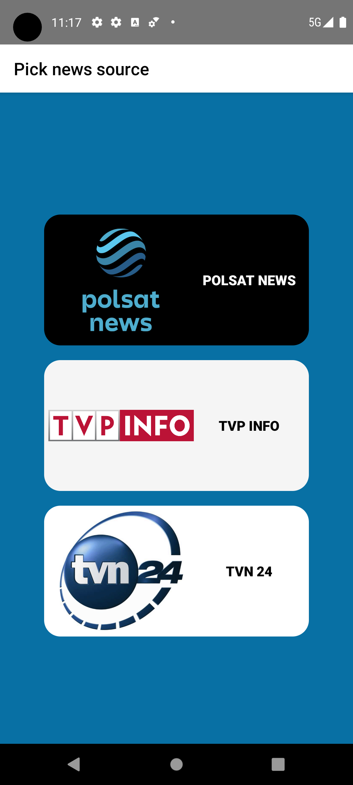
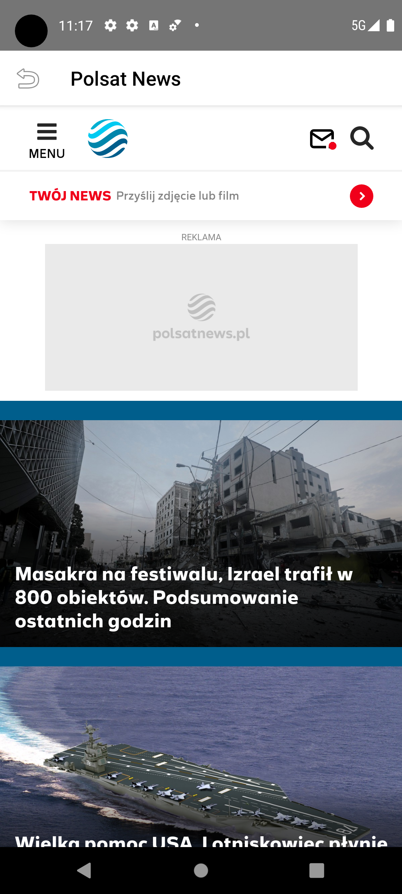
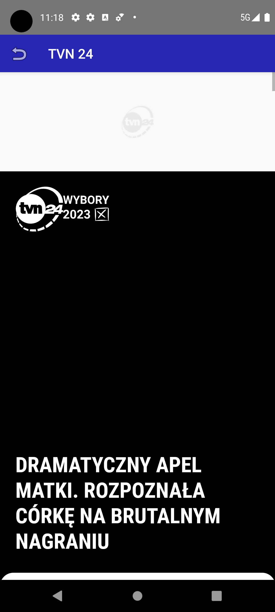

# Polish news journal manager
The ***Mobile Application 📲*** for **Android** and **IOS** which show you swiftly informations from Poland and World throught the most popular Polish news portals. All what you need is only two clicks from your mobile device 👆📱

## Tech stack:
 NativeScript/SvelteNative

### Overview:
1. **Main Screen**
<br>

2. **Polsat News**
<br>

3. **TVP INFO**
<br>

4. **TVN 24**
<br>


## Installation
```bash
$ git clone https://github.com/kotekpsotek/mobile-journal.git
```

## Prerequsites to build locally
This project require from you installation tools such as: **Android SDK**, **JDK** and mainly ***NativeScript***.<br>
All steps which leads to complete required configuration depends from your OS and was paritaly described on [NativeScript ENV Setup](https://docs.nativescript.org/environment-setup.html)

### Additional note
Whole project was created with one keynote "Make tool to abbreviate checking activity common for most peoples" above that, whole is not and will not be used for commerical purposes

## License
Whole my code is under Apache 2.0

<h3 align="center">Made with <b>Native❤️</b></h3>
